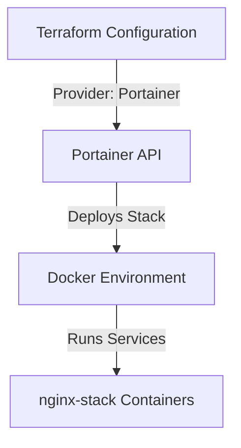

# Terraform Portainer Stack Deployment

This project demonstrates how to use the [Portainer Terraform provider](https://registry.terraform.io/providers/portainer/portainer/latest) to deploy a Docker stack (`nginx`) into a Portainer-managed environment.

## Features

* Connects to a Portainer instance via API.
* Deploys a stack (`nginx-stack`) using a `docker-compose.yml`.
* Supports configuration via Terraform variables.
* Works with **standalone** Docker environments.

---

## Project Structure

```
.
├── main.tf              # Terraform provider and resource definitions
├── variables.tf         # Input variable definitions
├── terraform.tfvars     # Variable values (not committed to Git for security)
└── docker-compose.yml   # Stack definition
```

---

## Requirements

* [Terraform](https://developer.hashicorp.com/terraform/downloads) >= 1.0
* A running **Portainer instance** with API access
* Portainer API key (with stack management permissions)
* Docker Compose YAML (`docker-compose.yml`) for your stack

---

## Configuration

### Variables

| Variable            | Description                       | Type   | Default        |
| ------------------- | --------------------------------- | ------ | -------------- |
| `portainer_api_key` | Portainer API key                 | string | n/a (required) |
| `endpoint_id`       | Portainer environment/endpoint ID | number | n/a (required) |
| `stack_name`        | Name of the stack in Portainer    | string | `nginx-stack`  |

### Example `terraform.tfvars`

```hcl
portainer_api_key = "ptr_your_api_key_here"
endpoint_id       = 2
stack_name        = "nginx-stack"
```

---

## Usage

1. **Clone this repository**

   ```bash
   git clone https://github.com/your/repo.git
   cd repo
   ```

2. **Initialize Terraform**

   ```bash
   terraform init
   ```

3. **Review the plan**

   ```bash
   terraform plan
   ```

4. **Apply the configuration**

   ```bash
   terraform apply
   ```

5. **Destroy the stack (optional)**

   ```bash
   terraform destroy
   ```

---

## Architecture Diagram



---

## Security Notes

* **Never commit your API keys**. Store them in `terraform.tfvars` or use environment variables.
* Consider using [Terraform Cloud/CLI environment variables](https://developer.hashicorp.com/terraform/cli/config/environment-variables) for secrets.
* If using self-signed certs, you may need `skip_ssl_verify = true`.

---

## References

* [Terraform Portainer Provider](https://registry.terraform.io/providers/portainer/portainer/latest)
* [Portainer Documentation](https://docs.portainer.io/)
